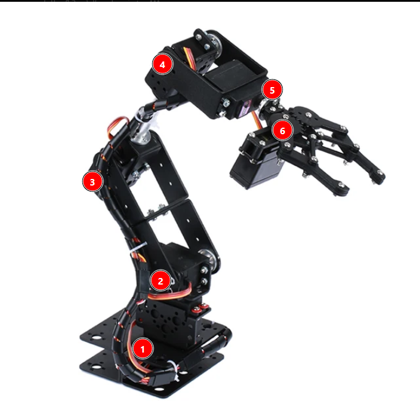
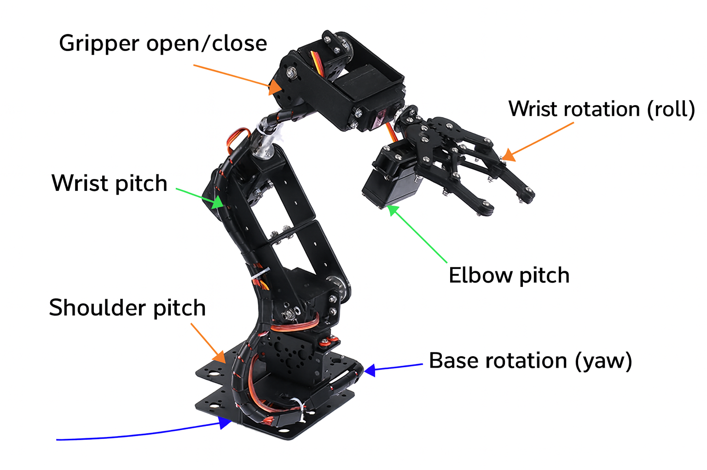
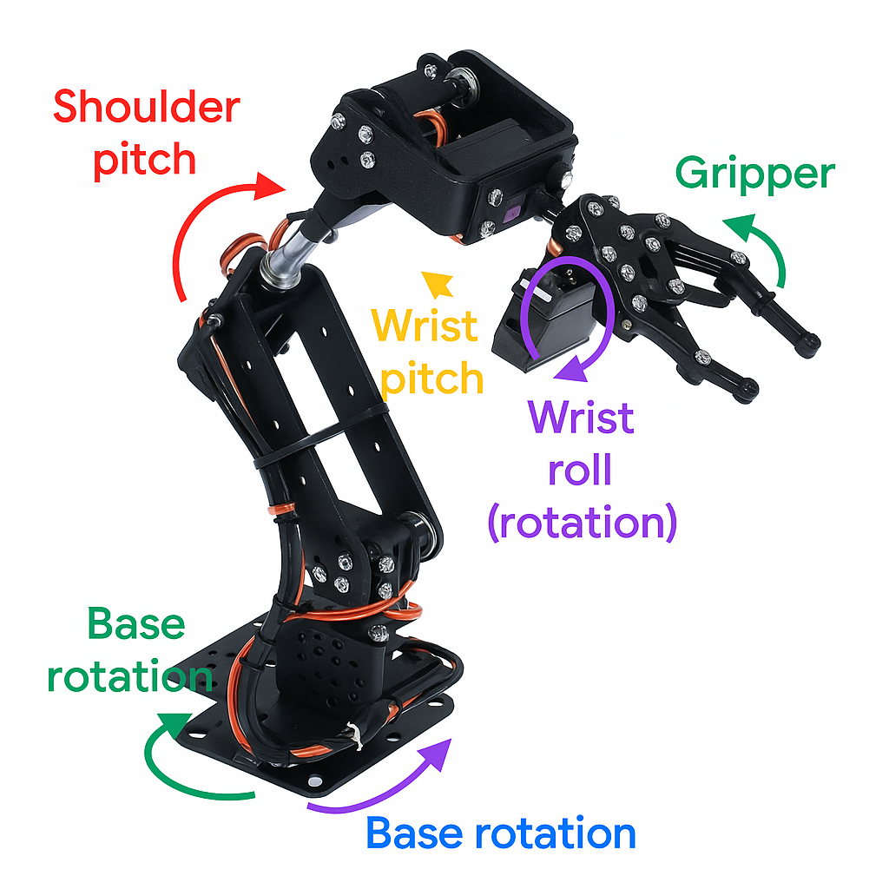

### ⚙️ Struktur Lengkap 6 DOF Robot Arm

| No   | Nama Joint                | Sumbu Gerak | Arah Rotasi / Translasi                | Fungsi                                  |
| ---- | ------------------------- | ----------- | -------------------------------------- | --------------------------------------- |
| 1️⃣    | **Base rotation (Yaw)**   | Z-axis      | Rotasi kiri–kanan di pangkal           | Memutar seluruh lengan di atas meja     |
| 2️⃣    | **Shoulder pitch**        | Y-axis      | Naik–turun bagian utama lengan         | Mengangkat atau menurunkan lengan       |
| 3️⃣    | **Elbow pitch**           | Y-axis      | Melipat atau meluruskan siku           | Menjangkau ke depan/belakang            |
| 4️⃣    | **Wrist pitch**           | Y-axis      | Naik–turun bagian pergelangan          | Menyesuaikan orientasi vertikal gripper |
| 5️⃣    | **Wrist roll (rotation)** | X-axis      | Rotasi sekeliling sumbu panjang lengan | Memutar posisi gripper                  |
| 6️⃣    | **Gripper open/close**    | Linear      | Menjepit atau melepas objek            | Memegang benda                          |

------

### 🔁 Arah Rotasi (visualisasi yang akan ditambahkan di anotasi baru nanti)

- **Base rotation:** panah melingkar horizontal di bawah.
- **Shoulder pitch:** panah melingkar di sendi besar pertama.
- **Elbow pitch:** panah melingkar di sendi tengah.
- **Wrist pitch:** panah melingkar kecil di sendi dekat gripper.
- **Wrist roll:** panah melingkar mengelilingi sumbu panjang gripper.
- **Gripper:** dua panah kecil berlawanan arah di jari-jari penjepit.

Arah Rotasi

